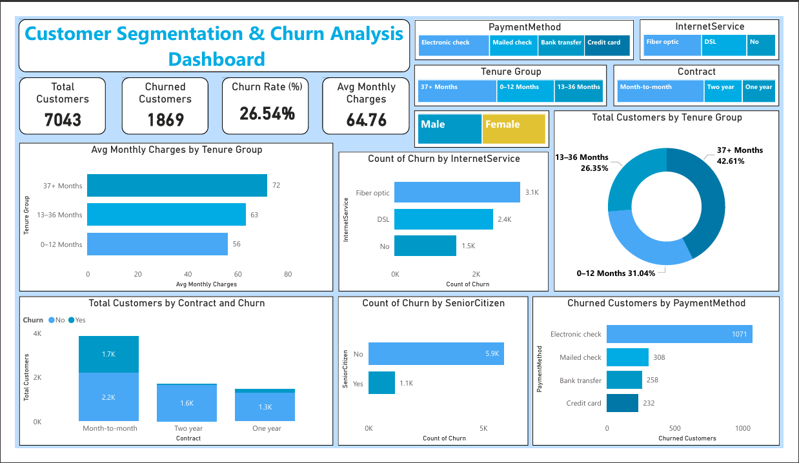

# 📊 Customer Segmentation Analysis

This project focuses on analyzing **customer churn behavior** in a telecommunications company using **data analysis, visualization, customer segmentation, and business insights**. The objective is to identify at-risk customer segments, understand key churn drivers, and provide actionable recommendations to improve customer retention.

        

---

## 🎯 Project Objective

The primary objective of this project is to:

* Analyze customer churn patterns
* Segment customers based on tenure and behavior
* Identify key churn drivers such as contracts, payment methods, services, and demographics
* Analyze customer lifecycle and spending patterns
* Provide **actionable business recommendations** to reduce customer churn and improve retention

---

## 📁 Project Folder Structure

```text
├── README.md
├── requirements.txt
│
├── Dashboard/
│    └── Customer_Segmentation_Churn_Dashboard.pbix
│
├── Data/
│    └── Telco_Customer_Churn_Dataset.csv
│
├── Docs/
│    └── Customer_Segmentation_Churn_Dashboard.pdf
│
├── Notebook/
│    └── Customer Segmentation Analysis.ipynb
│
└── images/
    ├── 01_Churn_vs_Non-Churn_Distribution.png
    ├── 02_Tenure_Distribution.png
    ├── 03_Monthly_Charges_vs_Churn.png
    ├── 04_Customer_Distribution_by_Tenure_Group.png
    ├── 05_Average_Monthly_Charges_by_Tenure_Group.png
    ├── 06_Churn_Rate_by_Tenure_Group.png
    ├── 07_Churn_by_Gender.png
    ├── 08_Churn_by_Senior_Citizen.png
    ├── 09_Churn_by_Contract_Type.png
    ├── 10_Churn_by_Payment_Method.png
    └── Customer_Segmentation_Churn_Dashboard.png
```

---

## 📊 Dataset Overview

* **Dataset:** Telco Customer Churn Dataset
* **Target Variable:** `Churn` (`Yes` / `No`)
* **Customer Information:** Gender, senior citizen status, partner, dependents
* **Account Information:** Tenure, contract type, paperless billing, payment method
* **Services:** Phone, internet, security, backup, device protection, technical support, streaming
* **Financial Metrics:** Monthly charges and total charges

---

## 🧩 Project Tasks & Methodology

### ✅ Task 1: Dataset Understanding

* Loaded and explored the dataset using Pandas
* Displayed initial customer records
* Identified data types of each column
* Checked for missing values
* Reviewed the structure and characteristics of the dataset

### ✅ Task 2: Data Cleaning

* Standardized column names
* Converted `TotalCharges` to an appropriate numerical data type
* Handled missing values
* Removed duplicate records
* Ensured data consistency and readiness for analysis

### ✅ Task 3: Exploratory Data Analysis (EDA)

* Generated descriptive statistics
* Analyzed churn vs. non-churn distribution
* Examined tenure distribution
* Analyzed monthly charges across churn categories
* Created histograms, box plots, and categorical visualizations
* Identified important customer churn patterns

### ✅ Task 4: Customer Segmentation Visualization

Customers were segmented into three tenure-based lifecycle groups:

* **0–12 Months**
* **13–36 Months**
* **37+ Months**

The analysis includes:

* Customer distribution by tenure group
* Average monthly charges by tenure group
* Tenure-based customer lifecycle analysis
* Visual identification of significant trends

### ✅ Task 5: Advanced Analysis

Performed comparative analysis of customer churn across:

* Tenure groups
* Gender
* Senior citizen status
* Contract type
* Payment method
* Customer service and subscription characteristics

The analysis was used to identify **high-risk customer segments** and translate findings into actionable business recommendations.

---

## 📈 Sample Visualizations

### Churn Distribution


### Customer Distribution by Tenure Group


### Average Monthly Charges by Tenure


### Churn by Contract Type


---

## 📊 Power BI Dashboard

An **interactive Power BI dashboard** was developed to provide a comprehensive view of customer churn, customer segmentation, and key business metrics.

### Dashboard Highlights

* KPI cards for:

  * Total Customers
  * Churned Customers
  * Churn Rate
  * Average Monthly Charges
* Tenure-based customer segmentation
* Churn analysis by contract type
* Churn analysis by payment method
* Churn analysis by internet service
* Demographic churn analysis
* Interactive slicers for dynamic data exploration

### Dashboard Files

* `Customer_Segmentation_Churn_Dashboard.pbix`
* `Customer_Segmentation_Churn_Dashboard.pdf`



---

## 🧠 Key Business Insights

* Customers on **month-to-month contracts** demonstrate the highest churn tendency.
* **New customers within the 0–12 month tenure segment** represent an important retention-risk group.
* Customers using **electronic check payments** show comparatively higher churn.
* Customers with **long-term contracts** demonstrate stronger retention.
* Higher monthly charges are associated with increased churn among certain customer segments.
* Customer tenure provides valuable insight into customer lifecycle and retention behavior.

---

## 💡 Business Recommendations

### 🎯 Improve Early-Stage Customer Retention

Develop stronger onboarding programs and engagement strategies for customers during their first 12 months.

### 📄 Encourage Long-Term Contracts

Offer incentives, discounts, or additional benefits to encourage customers to move from month-to-month contracts to longer-term plans.

### 💳 Promote Automatic Payment Methods

Encourage customers to adopt automatic payment options to improve payment convenience and potentially strengthen retention.

### ⭐ Strengthen Customer Loyalty

Introduce targeted loyalty programs and personalized offers for high-value and long-tenure customers.

### 💰 Improve Value Perception

Review pricing and service bundles for customers with higher monthly charges to ensure that perceived value aligns with customer expectations.

---

## 🚀 Skills Demonstrated

* Business Analysis & Data Interpretation
* Customer Segmentation
* Exploratory Data Analysis (EDA)
* Data Cleaning & Preprocessing
* Statistical Analysis
* Data Visualization
* Python Data Analysis
* Power BI Dashboard Development
* KPI Analysis
* Customer Churn Analysis
* Insight-driven Decision Making
* Business Storytelling

---

## 🧑‍💻 Author

**👤 Harsh Belekar**  
📍 Data Analyst | Python Developer | SQL | Power BI | Excel | Data Visualization  
📬 [LinkedIn](https://www.linkedin.com/in/harshbelekar) | 🔗[GitHub](https://github.com/Harsh-Belekar)

📧 [harshbelekar74@gmail.com](mailto:harshbelekar74@gmail.com)

---

⭐ *If you found this project helpful, feel free to star the repo and connect with me for collaboration!*
